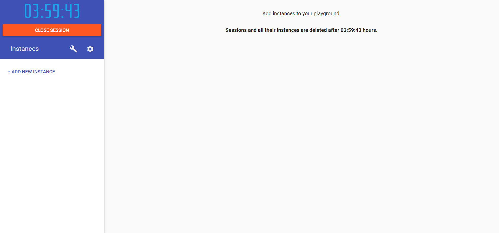
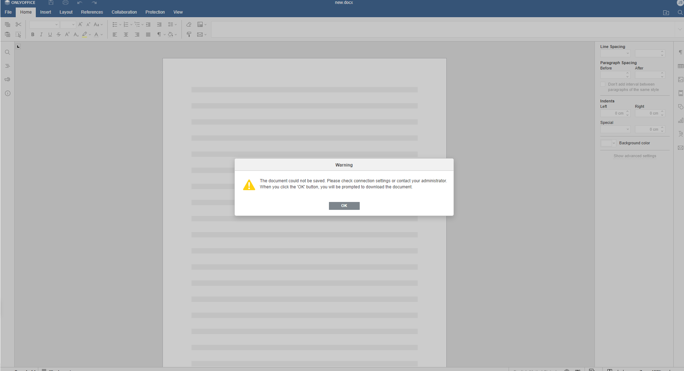
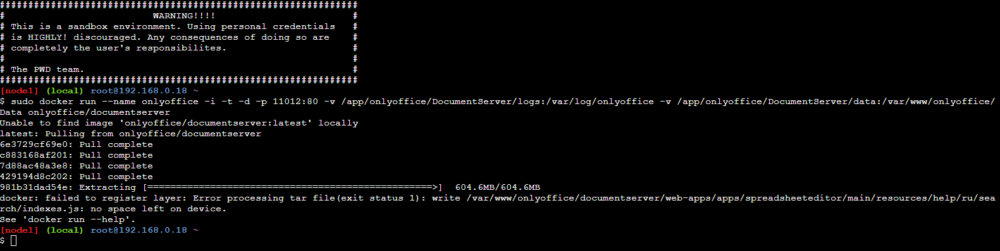

# Dokumentation Woche 1
Autor: Swissnik\
Modul: 169\
Datum: 13.02.2023\
Version: 1.5

## Was ist ein Container?
Ein Container ist eine virtuelle Umgebung, in denen Anwendungen ausgeführt werden können. Container brauchen kein eigenes Betriebssystem, sondern nutzen das Host-Betriebssystem, dies spart Ressourcen und ermöglicht, dass man für mehrere Container nur ein Betriebssystem benötigt.\

Quelle: [Geekflare](https://geekflare.com/de/docker-vs-virtual-machine/)

## Was ist DevOps?
DevOps ist ein Ansatz der Zusammenarbeit von einem Softwareentwicklungsteam und einem IT-Operations-Team, dies bildet ein DevOps Team. Das Ziel dieser Zusammenarbeit ist die Steigerung der Effizienz und die Automatisierung von Prozessen.

## Was sind die Unterschiede von Virtualisierungen und Containerisierung?
### Betriebssystem
Eine virtuelle Maschine braucht zwingend ein eigenes Betriebssystem und ist deswegen ziemlich schwer. Im Gegenzug brauchen Container kein eigenes Betriebssystem und können sich das Host-Betriebssystem teilen, aus diesem Grund sind Container um einiges leichter und flexibler als virtuelle Maschinen.

### Sicherheit
Weil eine virtuelle Maschine immer ein eigenes Betriebssystem braucht, ist eine starke Abgrenzung zwischen mehreren virtuellen Maschinen vorhanden, da dies bei Containern nicht der Fall ist, sind virtuelle Maschinen grundsätzlich sicherer.

### Tragbarkeit
Container sind leicht zu transportieren, weil sie kein eigenes Betriebssystem haben, deswegen kann man sie ganz einfach auf ein anderes Betriebssystem verschieben und sie ohne Probleme starten. Das Verschieben von virtuellen Maschinen gestaltet sich jedoch wegen des eigenen Betriebssystems schwieriger und es beansprucht um eigenes mehr Zeit.

### Leistung
Ein Container startet meistens innerhalb von Sekunden, während eine virtuelle Maschine immer noch daran ist, das Betriebssystem hochzufahren und alle Treiber zu initialisieren.

### Zusammenfassung
Eine Zusammenfassung der wichtigsten Unterschiede in einer Tabelle.

| Virtuelle Maschine | Container |
| --- | --- |
| Prozessisolation auf Hardwareebene | Prozessisolation auf Betriebssystemebene |
| Jede VM verfügt über ein separates Betriebssystem | Jeder Container kann das Betriebssystem gemeinsam nutzen |
| Bereit in Minuten | Bereit in Sekunden |
| VMs haben nur wenige GB | Container sind leicht (KBs / MBs) |
| Vorgefertigte VMs sind schwer zu finden | Vorgefertigte Docker-Container sind leicht verfügbar |
| VMs können problemlos auf einen neuen Host verschoben werden | Container werden zerstört und neu erstellt, anstatt sich zu bewegen |
| Das Erstellen einer VM dauert relativ lange | Container können in Sekunden erstellt werden |
| Mehr Ressourcennutzung | Weniger Ressourcenverbrauch |

Quelle: [Geekflare](https://geekflare.com/de/docker-vs-virtual-machine/)

## Abgabe: Printscreen Play with Docker eingeloggt.

## Was sind die Unterschiede von Image und Container?
Eine Zusammenfassung der wichtigsten Unterschiede in einer Tabelle.

| Image | Container |
| --- | --- |
| Eine Vorlage oder Bauplan für einen Container | Eine Instanz von einem Image |
| Nur "read-only" Rechte | Kann zur Laufzeit verändert werden |
| Enthält ein reduziertes Betriebssystem und alle Abhängigkeiten für eine Anwendung | Enthält nur den Code und Abhängigkeiten der ausgeführten Anwendung/des Dienstes |
| Besteht aus mehreren Ebenen | Abhängig von einem Image |
| Images werden über eine Image-Registry abgerufen | Container können aus einem Image gestartet werden |
| Kann nicht gelöscht werden, solange Container es verwenden | Kann gestoppt und zerstört werden |
| Enthält keinen Kernel | Teilt den Kernel des Hosts |

## Zusammenfassung der wichtigsten Docker Befehle und Ihre Funktion.
Alle fettgedruckten Befehle wurden aktiv verwendet.
### Container Befehle
- ***docker run [Image]***\
Erstellt und startet ein Container von einem Image.
- ***docker exec [Container]***\
Führt ein Befehl innerhalb des Containers aus.
- ***docker rm [Container]***\
Löscht ein Container.
- docker update [Container]\
Aktualisiert die Konfiguration eines Containers.
- ***docker start [Container]***\
Startet ein Container.
- ***docker stop [Container]***\
Stoppt ein Container.
- ***docker restart [Container]***\
Startet ein Container neu.
- docker pause [Container]\
Pausiert ein laufenden Container.
- docker unpause [Container]\
Unpausiert ein laufenden Container.
- docker wait [Container]\
Blockiert ein Container, bis dieser gestoppt wird.
- ***docker kill [Container]***\
Forciert das Stoppen eines Containers.
- docker attach [Container]\
Verbindet sich mit dem Terminal eines Containers und zeigt dessen Outputs.

### Image Befehle
- docker build [Url]\
Erstellt ein Image von einem Dockerfile.
- docker pull [Image]\
Zieht ein Image von einem Registry.
- docker tag [Image] [Tag]\
Erstellt ein Tag.
- docker push [Image]\
Schiebt ein Image in eine Registry.
- docker import [Url/File]\
Erstellt ein Image von einer Datei.
- docker commit [Container] [Image]\
Erstellt ein Image von einem Container.
- ***docker rmi [Image]***\
Löscht ein Image.
- docker load [Tar/Stdin]\
Lädt ein Image aus einem Tar-Archiv oder stdin.

### Generelle Befehle
- docker login [Registry]\
In eine registry einloggen.
- ***docker image ls***\
Listet alle lokalen Images.
- docker history [Image]\
Zeigt den Verlauf eines Images.
- ***docker ps -a***\
Listet die Details von allen vorhandenen Containern. 
- docker network create [Netzwerk]\
Erstellt ein Netzwerk.
- docker network ls\
Listet alle Netzwerke.
- docker network rm [Netzwerk]\
Löscht ein Netzwerk.
- docker network inspect [Netzwerk]\
Zeigt Informationen zu einem Netzwerk.
- docker network connect [Netzwerk] [Container]\
Verbindet ein Container mit einem Netzwerk.
- docker network disconnect [Netzwerk] [Container]\
Trennt ein Container von einem Netzwerk.

## Abgabe: PrintScreen OnlyOffice.
Leider konnte ich nach mehreren Stunden herumprobieren keinen funktionierenden OnlyOffice Container erstellen. Ich habe versucht, den Container lokal auf meinem Laptop, über [smartlearn.iet-gibb.ch](https://smartlearn.iet-gibb.ch/) und in einer virtuellen Maschine zu erstellen, jedoch immer denselben Fehler erhalten, wenn ich versucht habe ein Dokument zu erstellen.

Ich habe auch versucht wie in der Anleitung OnlyOffice auf [play-with-docker.com](https://labs.play-with-docker.com/#) zu installieren, dies hat jedoch schon beim Herunterladen des Images fehlgeschlagen, da dies für [play-with-docker.com](https://labs.play-with-docker.com/#) zu gross ist. In der Anleitung wird die Version latest verwenden, was grundsätzlich ein No-Go ist, da man bei einer neueren Version nie wissen kann, ob alles noch gleich funktioniert und ich jetzt auch nicht wissen kann welche Version ursprünglich verwendet wurde.

Als ich dann jedoch auf meinem privaten PC probiert habe, OnlyOffice zu installieren, hat alles ohne Probleme geklappt. Meine Vermutung war dann, dass OnlyOffice einen speziellen Port nützt, der per Standard gesperrt ist, was sich dann auch nach einer kurzen google-Suche bestätigt hat.\
[Ports which must be opened for ONLYOFFICE Docs](https://helpcenter.onlyoffice.com/installation/docs-community-open-ports.aspx)

Meiner Meinung nach sollten solch wichtige Details in der Anleitung vorhanden sein.
