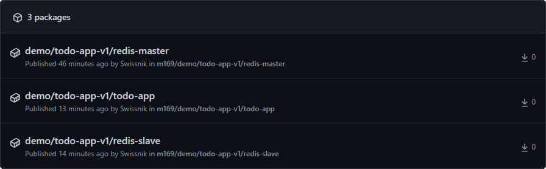
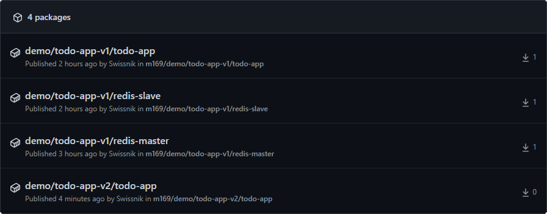

# Dokumentation Woche 2
Autor: Swissnik\
Modul: 169\
Datum: 17.02.2023\
Version: 1.6

## App version 1
### Abgabe: Printscreen der Images bei GitHub.

### Ein Image Pushen
#### Image auf [hub.docker.com](https://hub.docker.com)
    docker login
    docker image tag redis-master:v1 swissnik/redis-master:v1
    docker image tag redis-slave:v1 swissnik/redis-slave:v1
    docker image tag todo-app:v1 swissnik/todo-app:v1
    docker image push swissnik/redis-master:v1
    docker image push swissnik/redis-slave:v1
    docker image push swissnik/todo-app:v1

#### Image auf [github.com](https://github.com)
    docker login ghcr.io
    docker image tag redis-master:v1 ghcr.io/swissnik/m169/demo/todo-app-v1/redis-master:v1
    docker image tag redis-slave:v1 ghcr.io/swissnik/m169/demo/todo-app-v1/redis-slave:v1
    docker image tag todo-app:v1 ghcr.io/swissnik/m169/demo/todo-app-v1/todo-app:v1
    docker push ghcr.io/swissnik/m169/demo/todo-app-v1/redis-master:v1
    docker push ghcr.io/swissnik/m169/demo/todo-app-v1/redis-slave:v1
    docker push ghcr.io/swissnik/m169/demo/todo-app-v1/todo-app:v1

## App version 2
### Abgabe: Printscreen der Images bei GitHub.

## Zusammenfassung der wichtigsten Docker Befehle und Ihre Funktion.
Alle fettgedruckten Befehle wurden aktiv verwendet.
### Container Befehle
- ***docker run [Image]***\
Erstellt und startet ein Container von einem Image.
- docker exec [Container]\
Führt ein Befehl innerhalb des Containers aus.
- ***docker rm [Container]***\
Löscht ein Container.
- docker update [Container]\
Aktualisiert die Konfiguration eines Containers.
- docker start [Container]\
Startet ein Container.
- ***docker stop [Container]***\
Stoppt ein Container.
- docker restart [Container]\
Startet ein Container neu.
- docker pause [Container]\
Pausiert ein laufenden Container.
- docker unpause [Container]\
Unpausiert ein laufenden Container.
- docker wait [Container]\
Blockiert ein Container, bis dieser gestoppt wird.
- docker kill [Container]\
Forciert das Stoppen eines Containers.
- docker attach [Container]\
Verbindet sich mit dem Terminal eines Containers und zeigt dessen Outputs.

### Image Befehle
- ***docker build [Url]***\
Erstellt ein Image von einem Dockerfile.
- ***docker pull [Image]***\
Zieht ein Image von einem Registry.
- ***docker tag [Image] [Tag]***\
Erstellt ein Tag.
- ***docker push [Image]***\
Schiebt ein Image in eine Registry.
- docker import [Url/File]\
Erstellt ein Image von einer Datei.
- docker commit [Container] [Image]\
Erstellt ein Image von einem Container.
- docker rmi [Image]\
Löscht ein Image.
- docker load [Tar/Stdin]\
Lädt ein Image aus einem Tar-Archiv oder stdin.

### Generelle Befehle
- ***docker login [Registry]***\
In eine registry einloggen.
- docker image ls\
Listet alle lokalen Images.
- docker history [Image]\
Zeigt den Verlauf eines Images.
- docker ps -a\
Listet die Details von allen vorhandenen Containern. 
- ***docker network create [Netzwerk]***\
Erstellt ein Netzwerk.
- docker network ls\
Listet alle Netzwerke.
- docker network rm [Netzwerk]\
Löscht ein Netzwerk.
- docker network inspect [Netzwerk]\
Zeigt Informationen zu einem Netzwerk.
- docker network connect [Netzwerk] [Container]\
Verbindet ein Container mit einem Netzwerk.
- docker network disconnect [Netzwerk] [Container]\
Trennt ein Container von einem Netzwerk.
