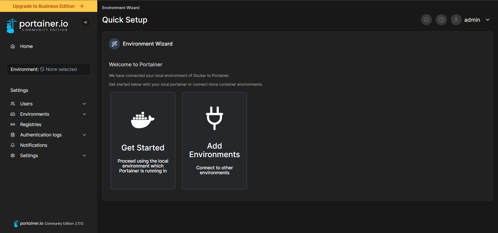
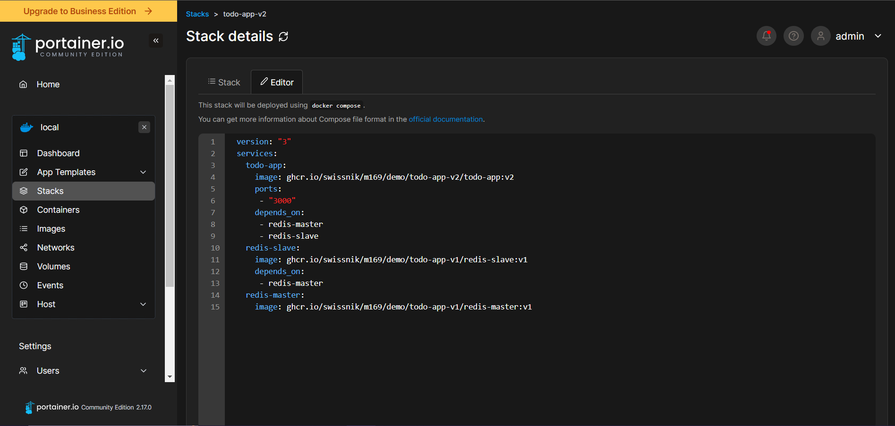

# Dokumentation Woche 3
Autor: Yannik Zechner\
Modul: 169\
Datum: 22.02.2023\
Version: 1.2

## Was ist Docker Compose?
Docker Compose ist ein Ansatz, der das Erstellen von Container automatisiert und vereinfacht. Dadurch können mehrere Befehle zum Erstellen mehrerer Container, Netzwerke und zum Starten der Container in der richtigen Reihenfolge in einem YAML-Skript automatisiert werden.

## App Version 2 ohne Docker Compose.
Ohne Docker Compose braucht man zum Starten der Todo-app viele Befehle, die in der richtigen Reihenfolge sein müssen.
### Pull Image
    docker pull ghcr.io/swissnik/m169/demo/todo-app-v1/redis-master:v1
    docker pull ghcr.io/swissnik/m169/demo/todo-app-v1/redis-slave:v1
    docker pull ghcr.io/swissnik/m169/demo/todo-app-v2/todo-app:v2
### Create Network
    docker network create todoapp_network
### Run Container
    docker run --net=todoapp_network --name=redis-master -d ghcr.io/swissnik/m169/demo/todo-app-v1/redis-master:v1
    docker run --net=todoapp_network --name=redis-slave -d ghcr.io/swissnik/m169/demo/todo-app-v1/redis-slave:v1
    docker run --net=todoapp_network --name=frontend -d -p ghcr.io/swissnik/m169/demo/todo-app-v2/todo-app:v2 
## App Version 2 mit Docker Compose.
[docker-compose.yml](files/docker-compose.yml)

    version: "3"
    services:
      todo-app:
        image: ghcr.io/swissnik/m169/demo/todo-app-v2/todo-app:v2
        ports:
        - "3000"
        depends_on:
        - ghcr.io/swissnik/m169/demo/todo-app-v1/redis-master
        - ghcr.io/swissnik/m169/demo/todo-app-v1/redis-slave
      redis-slave:
        image: ghcr.io/swissnik/m169/demo/todo-app-v1/redis-slave:v1
        depends_on:
        - ghcr.io/swissnik/m169/demo/todo-app-v1/redis-master
      redis-master:
        image: ghcr.io/swissnik/m169/demo/todo-app-v1/redis-master:v1

Um alle Container zu starten, kann man folgenden Befehl ausführen.

    docker compose -f docker-compose.yml up -d
    
Um alle Container zu stoppen, kann man folgenden Befehl benutzen.

    docker compose -f docker-compose.yml down

## Portainer installation.
Ich habe Portainer nach der Anleitung auf [play-with-docker.com](https://labs.play-with-docker.com/#) installiert.

## App Version 2 mit Portainer.
Um die Todo-app auf Portainer zu installieren, habe ich einen neuen Stack erstellt und dessen den Text meines [docker-compose.yml](files/docker-compose.yml) Files eingefügt.

## Sock-Shop installation.
Als Erstes muss man das nötige Repository klonen.

    git clone https://github.com/microservices-demo/microservices-demo
    
Dann geht man in das geklonte Directory.

    cd microservices-demo
    
Dann führt man das vorgefertigte Docker Compose File aus.

    docker-compose -f deploy/docker-compose/docker-compose.yml up -d

Sobald die Installation fertig ist, kann man Sock-Shop über den Port 80 erreichen.

