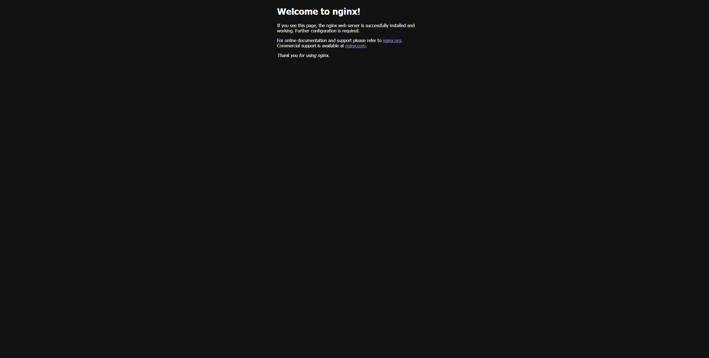
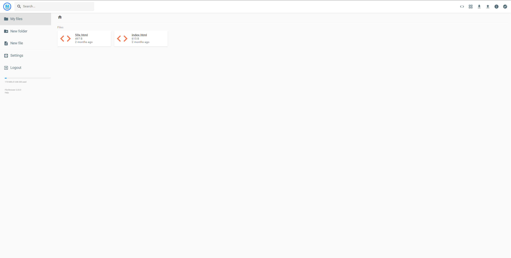
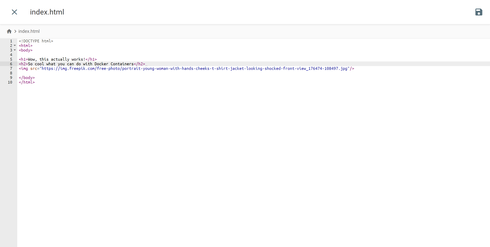
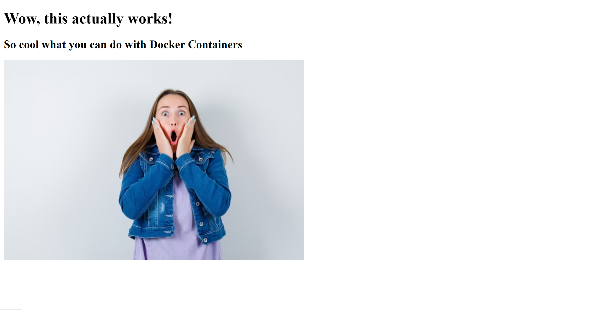

# Dokumentation Woche 4
Autor: Yannik Zechner\
Modul: 169\
Datum: 24.02.2023\
Version: 1.0

## Nginx Webserver mit einem Web-basierten Filebrower
Mein Projekt ermöglicht es, mit Docker Compose in Kürze einen Webserver zu betreiben, mit dem Vorteil, dass man die Daten der Webseite über eine Webapp managen kann.

## Installation
Als erstens klonen man mein Github Repository, in dem das Projekt gespeichert ist.

    git clone https://github.com/swissnik/m169/
   
Danach bewegt man sich in das richtige Directory.

    cd m169/demo/webserver/
    
Zur Ausführung des Docker Compose Files muss man nun einfach folgendes eingeben.

    docker-compose up -d
    
Nun kann man die Webseite über den Port 80 und den Filebrowser über den Port 443 aufrufen. Der Standardbenutzer für den Filebrower ist admin, mit dem Passwort admin. Man kann in den Einstellungen jederzeit einen neuen Benutzer mit einem sichereren Passwort erstellen oder dies direkt im Docker Compose File frühzeitig anpassen.

Nun kann man auf dem Filebrower seine Webseite hochladen, dann werden sie auf der Webseite angezeigt. Hier dazu ein kurzes Beispiel.

