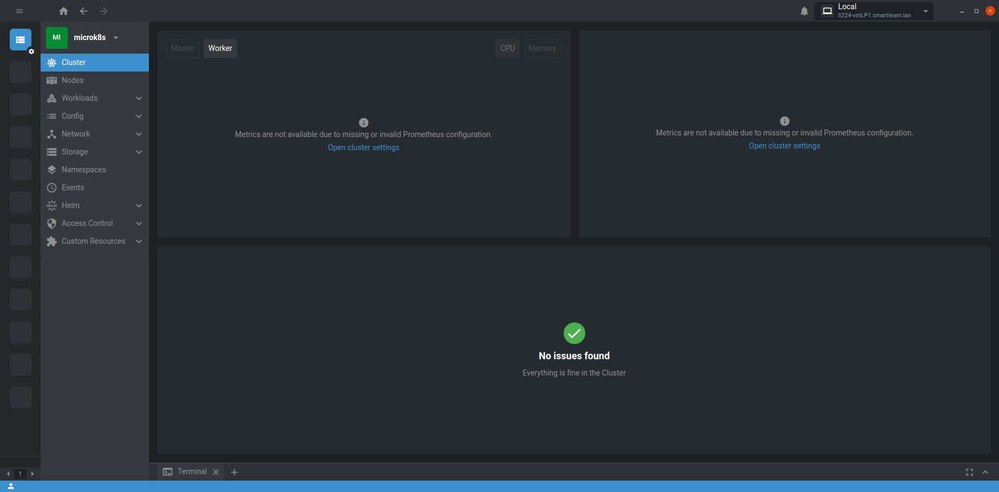

# Dokumentation Woche 5
Autor: Yannik Zechner\
Modul: 169\
Datum: 03.03.2023\
Version: 1.4

## Was ist Kubernetes?
Kubernetes ist ein Orchestrator von Cloud-basierten Microservice Anwendungen. Es verwendet anstatt der Monolith-Architektur die neuere und bessere Microservices-Architektur. Mit Kubernetes werden Container orchestriert, was so viel bedeutet wie Container konfigurieren, verwalten und koordinieren, dabei bietet Kubernetes eine skalierbare, hochverfügbare und sichere Lösung.

## Was ist Microservices?
Microservices ist der Nachfolger von Monolith und teilen eine grosse Anwendung in mehrere kleinere Prozesse auf, die sogenannten Microservices. Diese Architektur ermöglicht es, Code-Abhängigkeiten zwischen Prozessen zu verringern und so die Komplexität der Prozesse zu reduzieren, ohne dass andere Prozesse beeinflusst werden. Ein weiterer Vorteil wäre die Skalierbarkeit individueller Prozesse.

Quelle: [OpenLegacy](https://www.openlegacy.com/blog/monolithic-application)

## Vergleich der lightweight Kubernetes Anwendungen
| microk8s | k3s | minikube | Docker for Windows |
| --- | --- | --- | --- |
| CNCF zertifiziert | CNCF zertifiziert | CNCF zertifiziert | nicht CNCF zertifiziert 
| Vanilla Kubernetes | Managed Kubernetes | Vanilla Kubernetes | Vanilla Kubernetes |
| Single und multi-node Support | Single und multi-node Support | Single-node Support | Single & multi-node Support |
| x86, ARM64, s390x und POWER9 Support | x86, ARM64 und ARMhf Support | x86, ARM64, ARMv7, ppc64 und s390x Support | x86, ARM32, ARM64, AMD64, ppc64le, s390x, mips64le und riscv64 Support |
| Mind. 540MB RAM | Mind. 512MB RAM | Mind. 644MB RAM | Mind. 4GB RAM |

## Anleitung Installation microk8s
Mit den folgenden Befehlen kann man microk8s in Ubuntu installieren. Als erstens installiert man microk8s.

    sudo snap install microk8s --classic --channel=1.22/stable
    
Danach fügt man seinen Benutzer der microk8s Gruppe hinzu.
    
    sudo usermod -a -G microk8s vmadmin
    
Als Nächstes ändert man den Inhaber von /.kube zu seinem Benutzer. 
    
    sudo chown -f -R vmadmin ~/.kube
    
Jetzt startet man Ubuntu neu.

    sudo reboot
    
Glückwunsch, microk8s wurde installiert!

## Verbindung mit Lens auf den Server

