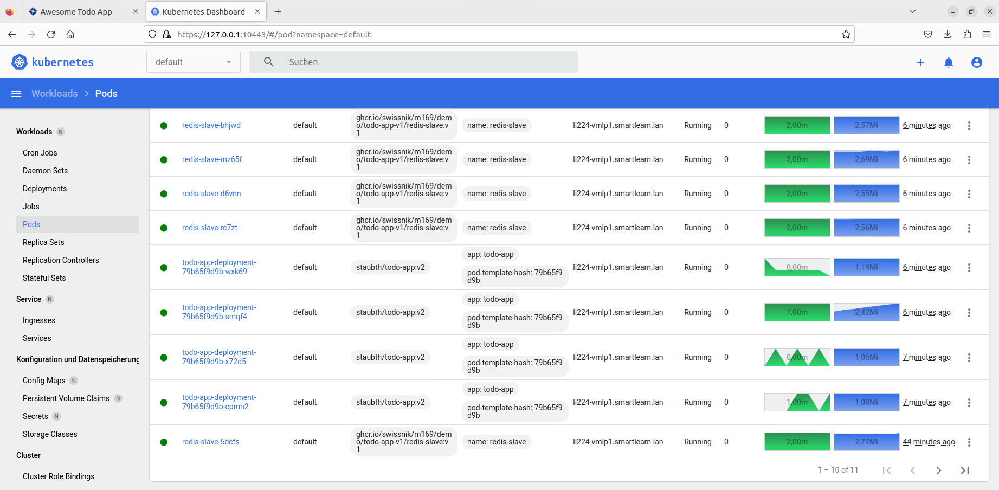

# Dokumentation Woche 6
Autor: Yannik Zechner\
Modul: 169\
Datum: 17.03.2023\
Version: 1.4

## Was ist der Raft-Konsens-Algorithmus?
In herkömmlichen Clustern gibt es Master-nodes und Worker-nodes, die der Administrator selbst bestimmen muss, das Problem dabei ist, dass es zu einer de-Synchronisation der Worker-nodes kommen kann und so Fehler auftreten können, die der Administrator selber beheben muss. Ein weiteres Risiko ist der Ausfall des Master-node, was zu einem kompletten Ausfall des Clusters führen kann, falls man nur einen Master-node konfiguriert hat.

Der Raft-Konsens-Algorithmus ist ein Algorithmus, der in Clustern eingesetzt werden kann, um eine höhere Ausfallsicherheit zu gewährleisten und um die Administration zu erleichtern. Dabei werden die Serverrollen automatisch verteilt, so wird bei Verlusts des Leader-node automatisch ein Follower-node zum neuen Leader-node gewählt. Weil der Leader-node ständig ein Heartbeat-Protokoll ausführt, wissen die Follower-nodes direkt nach Ausfall der Heartbeats, dass der Leader-node Offline ist und es wird eine sogenannte "Neuwahl" initiiert. Bei der Neuwahl vergleichen alle Follower-nodes ihren momentanen Stand und stimmen für den Follower-node mit dem neusten Stand ab. Es muss die Mehrheit aller Follower-nodes für ein für den gleichen Follower-node stimmen, dass dieser als Leader-node anerkannt wird.

Aus dem Grund das es der Mindeststimmanteil bei >50 % liegt, wird grundsätzlich empfohlen die Anzahl Nodes bei einer ungeraden Zahl zu halten, denn bei einem Cluster der Grösse 3 oder 4 kann jeweils nur ein Leader-node ausfallen, z. B. wenn in einem Cluster 2 von 4 Nodes ausfallen können die restlichen Follower-nodes keine Mehrheit mehr erreichen. In einem Cluster mit 5 Nodes können 2 Nodes ausfallen, da die restlichen Follower-nodes die Mehrheit bilden. Die Anzahl der Nodes sollte grundsätzlich nicht über 7 sein, da der Raft-Konsens-Algorithmus bei mehr Nodes an seine Grenzen kommt.

## App auf Kubernetes

## PrintScreen ihres Kubernetes Dashboards

## Self Healing
Self Healing ist eine Funktion in Kubernetes, die bei einem Ausfall eines Pods dies sofort erkennt und einen neuen Pod erstellt. Es werden ständig verglichen, wie viele Deploymentobjekte definiert wurden und wie viele laufen, um direkt bei einem Ausfall reagieren zu können.

## Scale Down
Mit Scale Down kann die Anzahl von einem bestimmten Pod verringern, das kann man entweder mit einem Befehl machen oder direkt in der Deployment Konfig ändern.

## Scale Up
Mit Scale Down kann die Anzahl von einem bestimmten Pod vergrössern, das kann man entweder mit einem Befehl machen oder direkt in der Deployment Konfig ändern.

## PrintScreen das Rolling Update funktioniert. Version 2 ist im Dashboard ersichtlich

## Blue Green Deployment
Blue Green Deployment ist ein Ansatz, der es vereinfacht eine Applikation zu aktualisieren oder zu warten und verbessert ausserdem die Ausfallzeit bei diesen Aufgaben. Blue Green Deployment führt zwei identische Umgebungen aus, diese nennt man Blue und Green. Eine der zwei Umgebungen ist jederzeit aktiv und wird verwendet. Die andere Umgebung ist dann im Ruhezustand.  Wenn man die Umgebung aktualisieren will, kann auf der Umgebung im Ruhezustand (z. B. Green) dies tun, ohne dass die aktive Umgebung (z. B. Blue) verändert wird. Sobald alle nötigen Tests auf Green abgeschlossen sind, kann man die Router austauschen und so wird Green zur neuen aktiven Umgebung.
