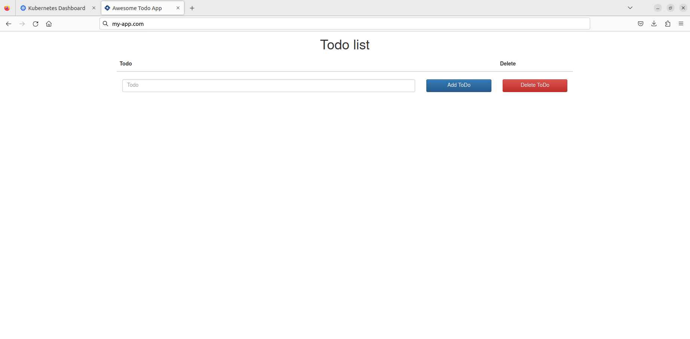
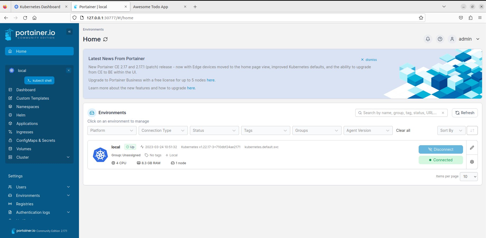

# Dokumentation Woche 7
Autor: Yannik Zechner\
Modul: 169\
Datum: 24.03.2023\
Version: 1.1

## Cluster IP
ClusterIP ist die Standardeinstellung eines Services und gibt dem Service eine Cluster-interne IP-Adresse, die man nicht ohne Proxy aus einem externen Netz erreichen kann.

## NodePort
NodePort ist eine Alternative zu ClusterIP und ermöglicht es den einzelnen Pods unter einem bestimmten Port der NodeIP (IP des Services) verfügbar zu sein.

## LoadBalancer
LoadBalancer ist eine weitere Alternative und macht den Service extern aufrufbar. Es wird ein LoadBalancer eines Cloudanbieters verwendet, der die NodePorts automatisch den Services zuweist. LoadBalancer ist die am häufigsten verwendete Art, hat jedoch zwei Nachteile: Jeder Service bekommt eine IP und es kann schnell sehr teuer werden.

## PrintScreen Wie Sie auf die App zugreiffen

## Namespace
Ein Namespace ist eine Abtrennung in einem Kubernetes Cluster. Damit können verschiedene Entwicklungsumgebungen in einem Cluster gleichzeitig laufen. Man kann jedem Namespace Ressourcen, Berechtigungen und Regeln hinzufügen. Namespaces sind unabhängig voneinander.

## PrintScreen wie Portainer auf Kubernetes installiert ist

