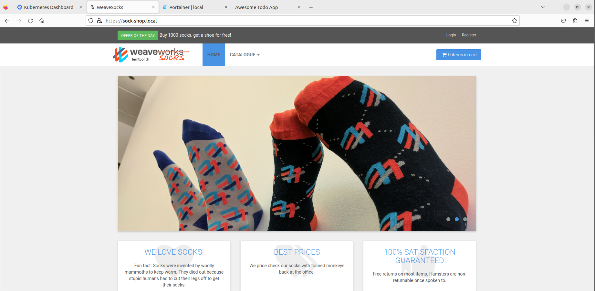
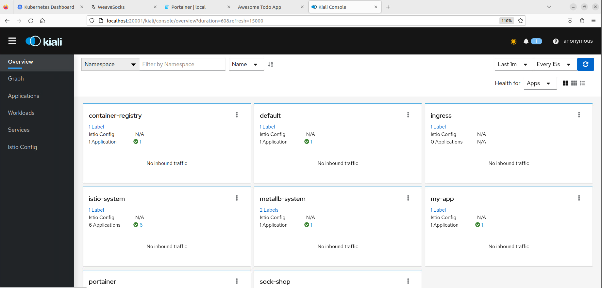
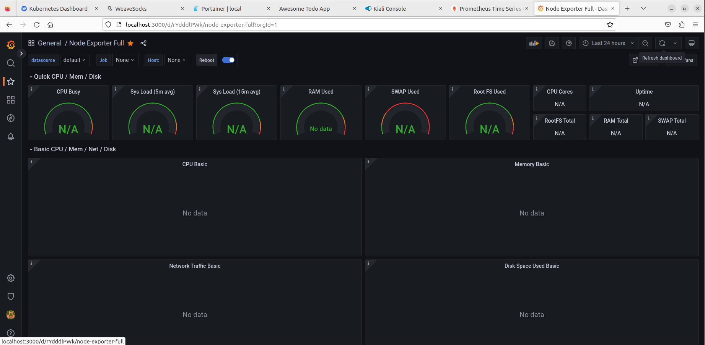
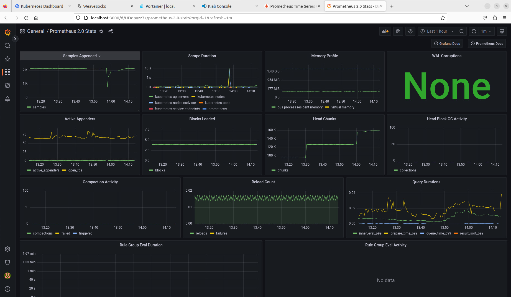

# Dokumentation Woche 8
Autor: Yannik Zechner\
Modul: 169\
Datum: 28.03.2023\
Version: 1.1

## Sock-Shop installiert

## Kiali läuft

## Grafana überwacht den Node
Nach der Anleitung sollte man Node Exporter Full verwenden, das hat bei mir nicht funktioniert, aber dafür ging ein anderes Monitoring Tool.

### Node Exporter Full

### Prometheus 2.0 Stats

